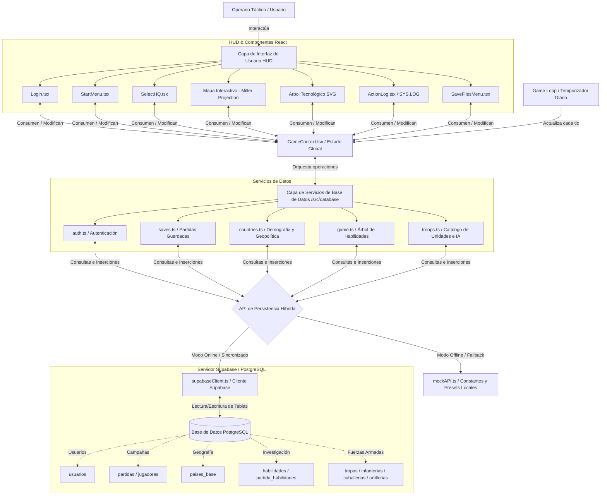

# CONQUEST

[](https://reactjs.org/)
[](https://www.typescriptlang.org/)
[](https://vitejs.dev/)
[](https://tailwindcss.com/)
[](https://supabase.com/)

---

## 1. Introducción y Visión General

**CONQUEST** es un simulador táctico de estrategia geopolítica global en tiempo real ambientado en un universo situado en el año 2099. El jugador asume el rol de un **Operario Táctico Global** a cargo de un cuartel general (Headquarters - HQ) estratégico, con el objetivo de gestionar recursos financieros, reclutar contingentes militares especializados, investigar tecnologías disruptivas y expandir su influencia mediante operaciones tácticas sobre un planisferio interactivo.

La interfaz de usuario está diseñada para simular una consola militar de comando de alta fidelidad, con efectos de barrido (scanlines), parpadeos tácticos, terminales de comandos de ejecución interactiva (`SYS.LOG`) y una visualización geoespacial detallada y receptiva de los límites de las naciones del planeta Tierra.

---

## 2. Mecánicas de Juego y Sistemas de Simulación

El simulador se compone de varios subsistemas lógicos interconectados que interactúan diariamente bajo un reloj de simulación central (*Game Loop*):

### A. Bucle de Simulación Central (Game Loop)
El juego progresa día a día en un calendario virtual. El operador puede pausar, reanudar o acelerar el tiempo en tres niveles de velocidad táctica. Cada "tic" diario procesa:
*   Crecimiento y declive demográfico de todos los países.
*   Cálculo de ingresos basados en el desarrollo económico de los territorios aliados/conquistados.
*   Deducción de costos de mantenimiento de tropas y gestión de bancarrota/deserción.
*   Desplazamiento y tiempo de tránsito de las fuerzas militares enviadas a misiones de conquista.
*   Disparadores de eventos probabilísticos globales y regionales.

### B. Simulación Demográfica y Económica Dinámica
Cada nación-estado en la simulación posee atributos vivos: población real (`poblacion_real_tierra`) e indicadores económicos asociados a su PIB/GDP (`gdp_per_capita_base`).
*   **Dinámica Poblacional:** Afectada por tasas de natalidad y mortalidad diarias. Estas tasas varían en función del estado político del país:
    *   *Conflictos Bélicos:* Multiplican drásticamente la mortalidad (p. ej., bajo asedio militar).
    *   *Crisis Financiera:* Si el presupuesto central cae a cero (bancarrota), la tasa de mortalidad en territorios controlados aumenta por falta de suministros básicos.
    *   *Políticas Especiales:* Habilidades del árbol de desarrollo (como el uso de nanobots médicos o conscripción agresiva) modifican las tasas demográficas de manera pasiva.
*   **Recaudación Fiscal e Ingresos:** El operador recauda créditos de oro de manera proporcional a la población y el PIB de su sede central y colonias. Esta ganancia se ve penalizada si el territorio se encuentra en guerra o en estado de reclutamiento forzado prolongado.

### C. Gestión y Logística Militar
El comando militar se estructura alrededor de un catálogo avanzado de **15 tipos de unidades tácticas** divididas en 3 categorías militares (Infantería, Caballería, Artillería):
1.  **Infantería:** Unidades como el *Cibersoldado de Asalto*, *Guardia de Neo-Tokio*, o *Exo-Soldado Pesado*. Se caracterizan por su menor costo y alta capacidad defensiva mediante bonos de trinchera.
2.  **Caballería:** Unidades de rápido despliegue como el *Motorista de Asalto Cyber*, *Nómada del Desierto*, o *Jinete de Neodraco*. Proporcionan bonos especiales de ataque por flanqueo.
3.  **Artillería:** Armamento pesado como el *Cañón de Plasma Pesado*, *Meca de Asedio Goliath*, o *Batería de Riel Magnético*. Cuentan con un elevado costo de adquisición, pero proveen devastadores bonos de penetración de plasma.

El sistema de logística calcula los costos de reclutamiento, el tiempo de tránsito (por defecto, 5 días de despliegue) y el mantenimiento diario en rangos acumulativos. En caso de no poder pagar el mantenimiento, las tropas inician un proceso de deserción sistemática.

### D. Motor de Eventos y Crisis Tácticas
La simulación presenta tres niveles de eventos aleatorios interactivos:
*   **Eventos Diarios Aleatorios:** Sucesos con recompensas o penalizaciones inmediatas (p. ej., sabotajes de red, interceptación de criptomonedas, reclutamiento de mercenarios).
*   **Eventos Críticos Narrativos:** Crisis mayores que abren un modal táctico y obligan al operador a elegir entre diversas opciones con consecuencias inmediatas y a largo plazo (p. ej., elegir si negociar con sindicatos cibernéticos o suprimir rebeliones mediante despliegue de infantería).
*   **Notificaciones de Decaimiento Temporal (Decaying Notifications):** Alertas en tiempo real con una barra de progreso que actúa como cuenta atrás visual en la pantalla principal. Si la barra llega a cero sin que el operario tome una acción, la crisis se resuelve sola con un impacto severo predefinido en la economía o población del HQ.

### E. Árbol Tecnológico (Investigación + Desarrollo)
Un panel interactivo SVG que representa las ramas tecnológicas disponibles para investigación científica y armamentística.
*   Presenta dependencias jerárquicas estrictas (requiere habilidades previas desbloqueadas).
*   Permite al jugador gastar créditos de oro acumulados para desbloquear pasivas de combate, reducciones de costo militar, mejoras médicas globales y eficiencias tributarias.
*   Incluye un módulo de reportes analíticos avanzados para auditar el impacto proyectado de cada rama científica en el presupuesto operativo.

---

## 3. Arquitectura de Software del Frontend

La arquitectura del frontend está construida sobre un modelo cliente-servidor desacoplado, diseñado para soportar almacenamiento persistente en la nube y funcionamiento autónomo offline para depuración:


### Diagrama de Conectividad y Flujo de Datos Completo

A continuación se detalla cómo se integran el operario, los componentes interactivos de la interfaz de usuario en React, el bucle de juego continuo, los servicios lógicos de la base de datos y las tablas de almacenamiento relacional de Supabase (PostgreSQL):



### Componentes Técnicos Clave

1.  **Motor Cartográfico (`react-simple-maps` + `d3-geo-projection`):** El planisferio táctico utiliza una proyección Miller. Los datos geográficos se renderizan dinámicamente mapeando los países en un contenedor interactivo con controles de zum y paneo nativos (`react-zoom-pan-pinch`). Cada país responde a eventos tácticos de selección, resaltando fronteras, alianzas de la IA, frentes de batalla activos y datos analíticos al pasar el cursor.
2.  **Gestión de Estado Centralizada (`GameContext` / `useGame`):** Coordina transversalmente el registro global de sucesos (`ActionLog`), la cola de notificaciones reactivas del HUD, la configuración y el flujo de los eventos críticos y los decaimientos de tiempo.
3.  **Capa de Acceso a Base de Datos Híbrida (`src/database/`):**
    *   `supabaseClient.ts`: Inicializa y expone el cliente de comunicación en tiempo real con Supabase.
    *   `auth.ts`: Gestiona el flujo de autenticación de operarios (usuarios autorizados) mediante tokens web.
    *   `saves.ts`: Controla la inicialización de campañas, guardado y carga de partidas persistiendo el estado en tablas PostgreSQL.
    *   `mockAPI.ts`: Provee presets de inicialización y constantes de balance geopolítico en caso de problemas de red o juego puramente local.

---

## 4. Estructura de Directorios del Proyecto

La organización lógica del código fuente es la siguiente:

```bash
src/
├── assets/              # Assets estáticos y configuraciones de diseño
├── components/          # Componentes visuales autónomos de la interfaz (HUD)
│   ├── ActionLog.tsx    # Terminal interactiva de registros históricos (SYS.LOG)
│   ├── CriticalEventModal.tsx  # Ventana de diálogo interactiva de eventos críticos
│   ├── CriticalEventWarning.tsx# Notificación flotante de advertencia
│   ├── Login.tsx        # Pantalla de acceso holográfica para operarios
│   ├── SaveFilesMenu.tsx# Panel de control de perfiles y campañas guardadas
│   ├── SelectHQ.tsx     # Selector del comando de operaciones geográficas iniciales
│   ├── StartMenu.tsx    # Pantalla holográfica de bienvenida y menú principal
│   ├── TacticalNotifications.tsx # Renderizado de notificaciones de decaimiento en cola
│   └── UserProfile.tsx  # Hoja de historial y estadísticas del operario autenticado
├── context/             # Proveedores globales de estado reactivo
│   └── GameContext.tsx  # Motor de eventos del HUD, alertas y sincronización del loop
├── database/            # Servicios de persistencia e integración de simulación
│   ├── auth.ts          # Seguridad y sesiones de autenticación
│   ├── countries.ts     # Censos geopolíticos, demografía y economía nacional
│   ├── game.ts          # Consultas e inserciones del árbol tecnológico
│   ├── reports.ts       # Cálculos matemáticos proyectados de inversión en I+D
│   ├── saves.ts         # Serializadores y cargadores de partidas guardadas
│   ├── supabaseClient.ts# Cliente Supabase principal
│   ├── troops.ts        # Algoritmos de combate, reclutamiento e índices militares
│   └── mockAPI.ts       # Generadores de eventos diarios y configuración offline
├── types/               # Definiciones y tipados estrictos de TypeScript
│   ├── habilidades.ts   # Esquemas de nodos del árbol tecnológico
│   ├── paises.ts        # Estructura del estado dinámico y estático nacional
│   ├── tacticalEvents.ts# Tipado de eventos probabilísticos y decaimientos
│   ├── tropas.ts        # Detalles relacionales de las 15 unidades del catálogo
│   └── user.ts          # Datos del operador del sistema
├── App.css              # Transiciones y efectos holográficos (luces neon, CRT glow)
├── App.tsx              # Componente raíz del juego, game loop y mapa reactivo
├── d3-geo-projection.d.ts # Tipados auxiliares para proyección cartográfica Miller
├── index.css            # Estilos globales, tipografías del sistema y tokens de Tailwind
└── main.tsx             # Punto de entrada de renderizado de React
```

---

## 5. Instalación, Configuración y Ejecución

### Requisitos Mínimos
*   **Node.js:** v18.0 o superior.
*   **NPM** o gestor de paquetes de preferencia (p. ej., PNPM, Yarn).

### Configuración del Entorno (`.env`)
1. Crea un archivo `.env` en la raíz del proyecto basándote en la plantilla `.env.example`:
   ```bash
   cp .env.example .env
   ```
2. Edita el archivo `.env` y configura tus credenciales de la instancia de Supabase asignada al simulador:
   ```env
   VITE_SUPABASE_URL=https://tu-proyecto.supabase.co
   VITE_SUPABASE_ANON_KEY=tu-anon-key-de-supabase
   ```

### Comandos de Desarrollo

*   **Instalación de Dependencias:**
    ```bash
    npm install
    ```
*   **Iniciar el Servidor de Desarrollo Local (Vite):**
    ```bash
    npm run dev
    ```
    El simulador estará disponible de forma predeterminada en `http://localhost:5173/`.

*   **Linter de Validación de Código:**
    ```bash
    npm run lint
    ```
*   **Compilar para Producción:**
    ```bash
    npm run build
    ```
    Este comando optimiza el empaquetado del cliente y genera los archivos finales listos para despliegue estático en la carpeta `dist/`.
