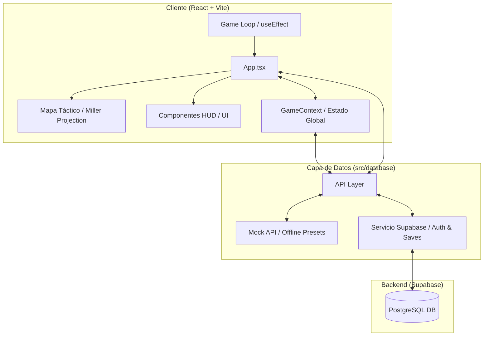

# CONQUEST — Frontend

[](https://reactjs.org/)
[](https://www.typescriptlang.org/)
[](https://vitejs.dev/)
[](https://tailwindcss.com/)
[](https://supabase.com/)

Interfaz de usuario para **CONQUEST**, un simulador estratégico de geopolítica global en tiempo real. Cuenta con un diseño "Cyberpunk/CRT" de alta fidelidad, planisferio interactivo y árbol de desarrollo tecnológico.

---

## Arquitectura y Decisiones de Diseño

El sistema separa la interfaz de usuario de la lógica de simulación, permitiendo sincronización remota y juego offline.



### Componentes de Arquitectura

- **Bucle de Simulación (Game Loop):** Procesa diariamente la demografía (natalidad/mortalidad), finanzas y avances militares.
- **Gestión de Estado (Context):** `GameContext` unifica el registro de sucesos (`ActionLog`), alertas y notificaciones tácticas.
- **Visualización Cartográfica:** Proyección Miller mediante `react-simple-maps` con controles de zoom y paneo interactivo.
- **Persistencia Híbrida:** Soporta sincronización en tiempo real con Supabase y modalidad local offline.

---

## Características Principales

- **Simulación Demográfica:** Atributos dinámicos por país afectados por guerra, reclutamiento o bancarrota.
- **Eventos y Decisiones:** Motor de eventos probabilísticos con notificaciones temporales y crisis críticas con cuenta regresiva.
- **Gestión de Ejércitos:** Reclutamiento, mantenimiento y combate de 15 tipos de unidades en 3 categorías militares.
- **Árbol Tecnológico (I+D):** Panel visual SVG interactivo con dependencias de prerrequisitos y costos de investigación escalables.
- **Perfil de Operario:** Registro persistente de estadísticas de juego y autenticación segura con Supabase.

---

## Estructura del Proyecto

- [src/components/](file:///d:/CONQUEST/CONQUEST_FRONTEND/src/components): Componentes HUD (Login, SelectHQ, ActionLog, etc.).
- [src/context/](file:///d:/CONQUEST/CONQUEST_FRONTEND/src/context): Proveedor global (`GameContext.tsx`) para la sincronización de estado.
- [src/database/](file:///d:/CONQUEST/CONQUEST_FRONTEND/src/database): Capa de persistencia (módulos Supabase y mock API local).
- [src/types/](file:///d:/CONQUEST/CONQUEST_FRONTEND/src/types): Definiciones de TypeScript para países, tropas y usuarios.
- [src/App.tsx](file:///d:/CONQUEST/CONQUEST_FRONTEND/src/App.tsx): Componente principal, bucle de simulación y contenedor HUD.
- [src/index.css](file:///d:/CONQUEST/CONQUEST_FRONTEND/src/index.css): Estilos globales, tokens de diseño y filtros estéticos CRT.

---

## Guía de Instalación y Ejecución

### Requisitos Previos

- **Node.js** v18 o superior
- **npm** (o gestor equivalente)

### Pasos para la Ejecución Local

1. **Configurar Variables de Entorno:**
   Copia `.env.example` como `.env` en la raíz del proyecto y define las credenciales de Supabase:

   ```bash
   cp .env.example .env
   ```

   ```env
   VITE_SUPABASE_URL=https://tu-proyecto.supabase.co
   VITE_SUPABASE_ANON_KEY=tu-anon-key-de-supabase
   ```

2. **Instalar Dependencias:**

   ```bash
   npm install
   ```

3. **Iniciar Servidor de Desarrollo:**

   ```bash
   npm run dev
   ```

4. **Compilar para Producción:**
   ```bash
   npm run build
   ```
