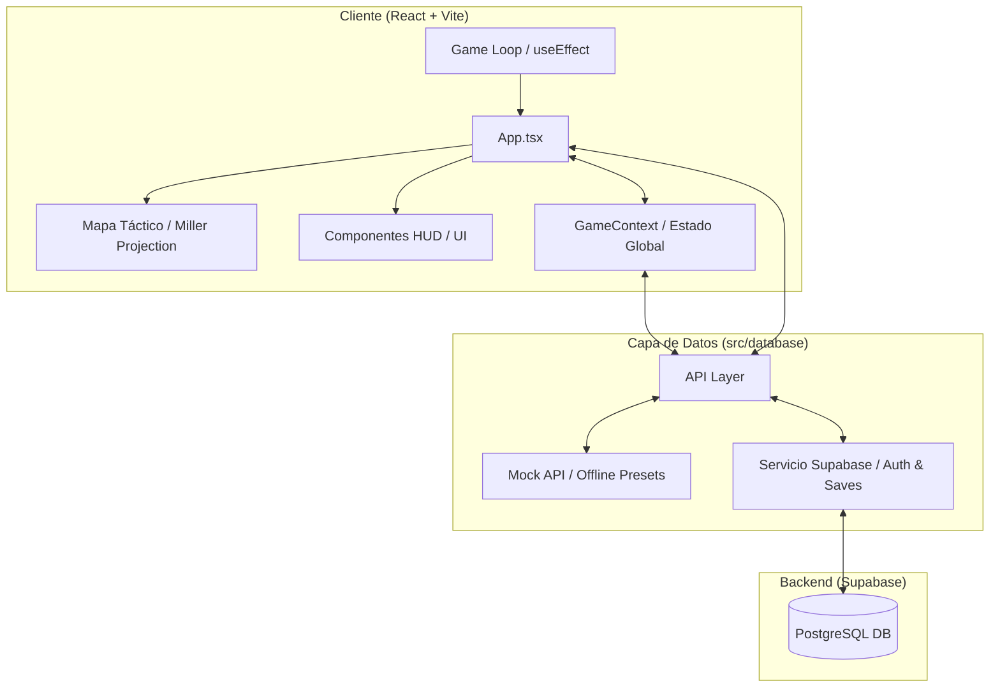

# CONQUEST — Frontend

[](https://reactjs.org/)
[](https://www.typescriptlang.org/)
[](https://vitejs.dev/)
[](https://tailwindcss.com/)
[](https://supabase.com/)

Interfaz de usuario para **CONQUEST**, un simulador estratégico de geopolítica global en tiempo real. Cuenta con un diseño "Cyberpunk/CRT" de alta fidelidad, planisferio interactivo y árbol de desarrollo tecnológico.

---

## Arquitectura y Decisiones de Diseño

El sistema separa la interfaz de usuario de la lógica de simulación, permitiendo sincronización remota y juego offline.



### Componentes de Arquitectura

- **Bucle de Simulación (Game Loop):** Procesa diariamente la demografía (natalidad/mortalidad), finanzas y avances militares.
- **Gestión de Estado (Context):** `GameContext` unifica el registro de sucesos (`ActionLog`), alertas y notificaciones tácticas.
- **Visualización Cartográfica:** Proyección Miller mediante `react-simple-maps` con controles de zoom y paneo interactivo.
- **Persistencia Híbrida:** Soporta sincronización en tiempo real con Supabase y modalidad local offline.

---

## Características Principales

- **Simulación Demográfica:** Atributos dinámicos por país afectados por guerra, reclutamiento o bancarrota.
- **Eventos y Decisiones:** Motor de eventos probabilísticos con notificaciones temporales y crisis críticas con cuenta regresiva.
- **Gestión de Ejércitos:** Reclutamiento, mantenimiento y combate de 15 tipos de unidades en 3 categorías militares.
- **Árbol Tecnológico (I+D):** Panel visual SVG interactivo con dependencias de prerrequisitos y costos de investigación escalables.
- **Perfil de Operario:** Registro persistente de estadísticas de juego y autenticación segura con Supabase.

---

## Estructura del Proyecto

```bash
src/
├── components/          # Componentes visuales de la interfaz táctica (HUD)
│   ├── Login.tsx        # Acceso de operarios (Supabase / Local)
│   ├── SelectHQ.tsx     # Selector geográfico de sede central (HQ)
│   ├── UserProfile.tsx  # Estadísticas de servicio del usuario
│   ├── StartMenu.tsx    # Menú principal holográfico
│   ├── SaveFilesMenu.tsx# Gestor de perfiles y campañas
│   └── ActionLog.tsx    # Historial de logs tácticos (SYS.LOG)
├── context/             # Proveedores de estado y contextos globales
│   └── GameContext.tsx  # Eventos, notificaciones y estado del simulador
├── database/            # Capa de datos y lógica del simulador
│   ├── auth.ts          # Lógica interna y flujos de autenticación
│   ├── countries.ts     # Carga, traducción y estadísticas geopolíticas
│   ├── troops.ts        # Catálogo relacional y fórmulas de combate
│   ├── game.ts          # Integración del árbol tecnológico de Supabase
│   ├── saves.ts         # Inicialización y persistencia de partidas
│   └── mockAPI.ts       # Constantes y plantillas de simulación local
├── types/               # Tipados estrictos de TypeScript
│   ├── user.ts          # Modelos de usuario y operarios
│   ├── paises.ts        # Modelos de países y estadísticas base
│   ├── tropas.ts        # Definiciones de tipos del catálogo militar
│   └── tacticalEvents.ts# Estructuras para eventos temporales y de crisis
├── App.tsx              # Componente raíz, game loop y mapas reactivos
└── index.css            # Estilos globales y tokens estéticos Cyberpunk/CRT
```

### Detalle de Directorios y Archivos Clave

- **[src/components/](file:///d:/CONQUEST/CONQUEST_FRONTEND/src/components):** Contiene los menús de navegación e indicadores en pantalla (HUD). Destacan [Login.tsx](file:///d:/CONQUEST/CONQUEST_FRONTEND/src/components/Login.tsx) para inicio de sesión, [SelectHQ.tsx](file:///d:/CONQUEST/CONQUEST_FRONTEND/src/components/SelectHQ.tsx) para selección de cuartel general y [ActionLog.tsx](file:///d:/CONQUEST/CONQUEST_FRONTEND/src/components/ActionLog.tsx) que actúa como terminal táctico.
- **[src/context/](file:///d:/CONQUEST/CONQUEST_FRONTEND/src/context):** Define [GameContext.tsx](file:///d:/CONQUEST/CONQUEST_FRONTEND/src/context/GameContext.tsx), que coordina las notificaciones tácticas, el control temporal del juego y la pausa forzada durante crisis críticas.
- **[src/database/](file:///d:/CONQUEST/CONQUEST_FRONTEND/src/database):** Conexión con Supabase y lógica de combate. Incluye [supabaseClient.ts](file:///d:/CONQUEST/CONQUEST_FRONTEND/src/database/supabaseClient.ts) para base de datos remota, [troops.ts](file:///d:/CONQUEST/CONQUEST_FRONTEND/src/database/troops.ts) para fórmulas matemáticas de combate y [mockAPI.ts](file:///d:/CONQUEST/CONQUEST_FRONTEND/src/database/mockAPI.ts) como fallback local offline.
- **[src/types/](file:///d:/CONQUEST/CONQUEST_FRONTEND/src/types):** Interfaces de datos que aseguran la robustez del tipado a lo largo de la simulación.
- **[src/App.tsx](file:///d:/CONQUEST/CONQUEST_FRONTEND/src/App.tsx):** Punto central del flujo; administra el game loop diario (finanzas, desgaste, invasiones) y el renderizado del mapa Miller.
- **[src/index.css](file:///d:/CONQUEST/CONQUEST_FRONTEND/src/index.css):** Define los esquemas de color temáticos y efectos CRT (scanlines y parpadeos).

---

## Guía de Instalación y Ejecución

### Requisitos Previos

- **Node.js** v18 o superior
- **npm** (o gestor equivalente)

### Pasos para la Ejecución Local

1. **Configurar Variables de Entorno:**
   Copia `.env.example` como `.env` en la raíz del proyecto y define las credenciales de Supabase:

   ```bash
   cp .env.example .env
   ```

   ```env
   VITE_SUPABASE_URL=https://tu-proyecto.supabase.co
   VITE_SUPABASE_ANON_KEY=tu-anon-key-de-supabase
   ```

2. **Instalar Dependencias:**

   ```bash
   npm install
   ```

3. **Iniciar Servidor de Desarrollo:**

   ```bash
   npm run dev
   ```

4. **Compilar para Producción:**
   ```bash
   npm run build
   ```
